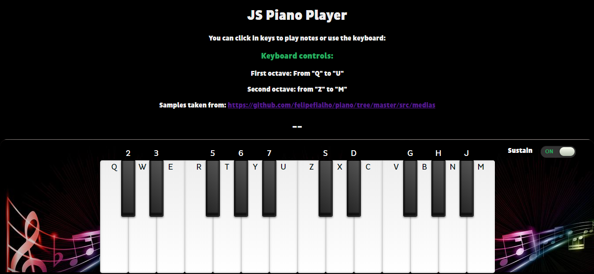
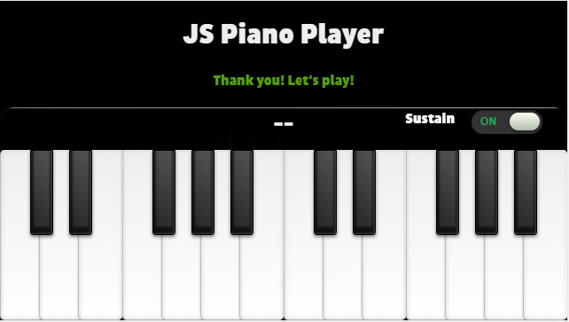
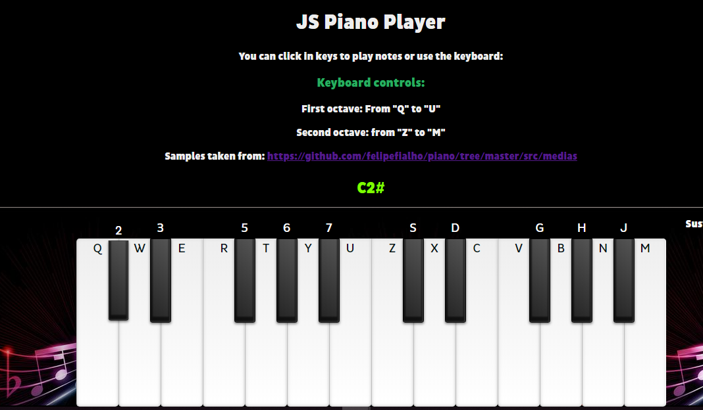
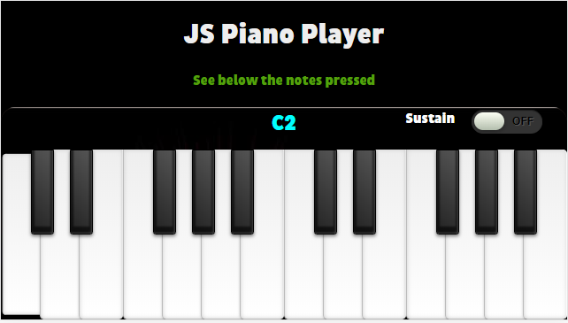
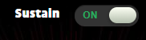

# JS Piano Player

This Piano Player was made with Vanilla JS. Find below the organization of this Challenge. Here we go!

## Piano Design

In order to design the piano, a three parts approach was defined: structure (HTML), style (CSS) and interactivity (JavaScript).

## HTML

First the piano was performed in the form of a list, where each < li > label corresponds to a piano key. This piano is made up of two octaves, what means, two sections of twelve keys, seven white keys and five black keys in each octave. The sections were duly separated at the code level, which facilitates their readability.

Then the references to the audio samples in the **[index.html](index.html)** file were preloaded.

Finally, a header with instructions was added. A checkbox was also added to enable or disable "Sustained" mode.

## CSS

In this part of the project styles were added to each key so you can see the effect when a key is pressed.

In order to follow the the "Mobile First" approach, three media queries were added to the **[style.css](css/style.css)** file.

Below you can see two screenshots of what the interface looks like in Desktop and Mobile:

**Desktop View:** 

In the previous view you can see that **each piano key has a key of the real-world computer keyboard assigned**, this is for facilitate the user experience.

**Mobile View:**

## JavaScript

For me this was the most challenging, I really enjoyed it. At first I started a little messy with the code but then everything was taking shape.

I divided this part into two files: helpers.js and listeners.js.

**[helpers.js](scripts/helpers.js)**

Basically here are the functions used by the listeners to be able to carry out the tasks of reproducing the sounds with the mouse, keyboard and touch events.

**[listeners.js](scripts/listeners.js)**

In this file I have nine listeners: 

- Two for play the audios with mouse (mousedown and mouseup)
- Two for play the audios with keyboard (keydown and keyup)
- Two for play the audios with touch in mobile devices (touchstart and touchend)
- Three for show the musical note of the key pressed (mousedown, keydown and touchstart)

## **Bonus Track**

 ### **1. Listeners for touch events in mobile devices**

 Touch events for mobile devices in order to make this project "Mobile First"

 ### **2. Listeners for show the musical note when a key is pressed** 

 In the following image you can see what i'm talking about 

**Desktop:**

**Mobile:**

 **Note:** This piano have the C2 and C3 octaves

 ### **3. Sustain Mode**

 Sustain mode checkbox visible in Desktop and mobile devices. You can see it in the image below: 

**References:** 

- The samples were extracted from: https://github.com/felipefialho/piano/tree/master/src/medias

- The checkbox (sustain mode) style was extracted from: https://codepen.io/bbodine1/pen/novBm 

